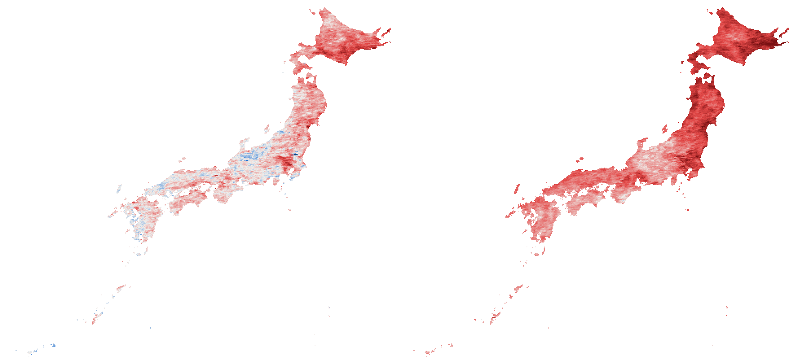

# 日本の夏は、夜が暑くなった

**https://japan-summer-nights.mdo4nt6n.workers.dev**

人工衛星が2000年から2024年まで25年間測り続けた、日本の夏の地表面温度。
昼と夜を切り替えられる Before/After 地図で、その差を見るための1画面。



<p align="center"><sub><b>左＝昼の変化量　／　右＝夜の変化量</b>　この25年で何度上がったか。<br>
2020–2024年の平均から2000–2004年の平均を引いた値。両方とも同じ物差し（±3℃、青が低下・赤が上昇）。<br>
昼は淡く、下がった場所（青）もある。夜は一様に赤い。</sub></p>

## 何が分かったか

最初は「日本の夏の暑さの変遷を見せる」つもりで作り始めた。
実装前にデータを取って確かめたところ、**昼間の地表面温度には有意な温暖化が出なかった**。

| | トレンド | t値 | 判定 | 2000-04 → 2020-24 |
|---|---|---|---|---|
| 昼 | +0.260 ℃/10年 | 1.94 | 有意でない | +0.59 ℃ |
| **夜** | **+0.636 ℃/10年** | **3.96** | **有意** | **+1.51 ℃** |

有意判定には |t| > 2.07 が必要（n=25、両側5%）。
夜は日本の陸ピクセルの **99.9%** が上昇している。

昼が見えない理由は、MODIS が**晴れた日しか観測できない**ことにある。
日本の夏は雲が多く、月平均は「その月にたまたま晴れた日」の寄せ集めになる。
梅雨の長短で年ごとのサンプリングが変わり、それが昼の年々変動（±0.50℃）を作って
トレンドを埋めてしまう。夜は日射と土壌水分の影響が抜けるぶん、信号が残る。

そこで企画の軸を「夏が暑くなった」から**「昼は変わらず、夜が暑くなった」**に変えた。
アプリで昼/夜を切り替えると、まだらな地図が一様な赤に変わる。その体験が結論を運ぶ。

昼のデータをあえて残してあるのは、「夜だけが上がった」と言うために
「昼は上がっていない」を見せる必要があるからだ。有意にならなかったという結果も、結果。

## 人にとって何を意味したか

温度の平均値は正確だが体には結びつかない。「寝苦しい夜が年に何日あったか」なら結びつく。
ERA5 再解析の気温から、各地点の2000〜2004年で上位10%に入る暑さの夜を数えた。

全国平均で **2000年 8.7日 → 2024年 33.3日**（約3.8倍）。

全国一律の「熱帯夜（25℃以上）」を使わないのは、再解析が10〜30km格子の平均値で
都市の実測より低く出るからだ。実測で猛暑日13日あった2010年の東京が、このデータでは
0日になる。各地点の過去を基準にすれば、その偏りは分子と分母に同じようにかかって
打ち消し合う。気候研究で標準的な手法でもある。

そして、この指標は実際に人が倒れた数をよく説明する。

| 熱中症搬送者数との関係（2010-2024、n=15） | 生の相関 | トレンド除去後 | 判定 |
|---|---|---|---|
| **特に寝苦しい夜の日数** | +0.821 | **+0.777** | 有意 (t=4.46) |
| 体感温度 | +0.624 | +0.573 | 有意 (t=2.52) |
| 夏の平均最低気温 | +0.612 | +0.552 | 有意 (t=2.39) |
| 衛星の夜の地表面温度 | +0.590 | +0.413 | **有意でない** (t=1.63) |

どちらも右肩上がりの量どうしは中身に関係なく相関するので、年で回帰した残差どうしの
相関まで見ないと見せかけかどうか分からない。気温ベースの指標はそれを通過するが、
**このサイトの主題である衛星の地表面温度は通過しない**。
人が倒れるのは地面の温度ではなく空気の温度と湿度だからで、筋は通っている。
自分に不利な結果もそのまま載せている。

## なぜ夜の地面が暑くなるのか

| 10年あたり | 地表面温度 | 気温 |
|---|---|---|
| 夜 | +0.636 ℃ | +0.375 ℃（最低気温） |
| 昼 | +0.260 ℃ | +0.729 ℃（最高気温） |

夜は**地面の方が空気より速く暖まっている**。気温が1℃上がると夜の地表面温度は
1.17℃上がる（昼は0.85℃）。夜の地面は日射を受けず、昼にためた熱を赤外線で逃がして
冷える。空気が暖かく湿っているほどその放熱が妨げられるので、気温の上昇が増幅されて
地表面温度に現れる。昼の地面は日射と土壌の乾湿に振り回されるため、気温との連動も
弱い（r=0.61、夜は0.86）。

言えないことも分けて書いてある。温室効果ガスの寄与を分離するには気候モデルでの
検出・要因特定の実験が要る。ここでできたのは「都市化では説明できない」ところまで。

## 地図の色で差を強調しないこと

初期版では、比較する2枚の地図を両方とも「25年平均からの差」で塗っていた。
これは**結論を絵で作りに行っていた**。その塗り方では前期は定義上ほぼ必ず平均より
低く（青）、後期は高く（赤）なるため、実際の差が +0.59℃ でも +1.51℃ でも
同じ青→赤のフルスイングに見えてしまう。

数字で見ると露骨だった。

```
1枚の地図の中の空間的な広がり（1〜99%タイル）:  昼 16.9℃ / 夜 12.1℃
25年での時間的な変化:                          昼 +0.59℃ / 夜 +1.51℃
```

空間差が十数℃あるのに時間変化は1〜2℃。同じ発色で描けば10分の1の量を
同じ迫力で見せることになる。そこで構造を分けた。

- **主地図は実測温度**。昼夜・前後期すべて共通の1本のスケール（5〜40℃）。
  25年前と今を並べても、ぱっと見ではほとんど変わらない。それが正直な見え方
- **変化量は別枠**。「後期 − 前期」をゼロ中心の発散配色で昼と夜に1枚ずつ。
  差を見せるならこれが正しい形で、左右で色を仕込む必要がない

配色も用途で分けてある。実測温度は順序尺度なので明度が単調に下がるヒートランプ
（凡例に実数値を添える）、変化量は極性を持つので発散配色（中点は無彩色）。

## 数字を読むときの注意

- **気温ではない。** 衛星が測るのは地面そのものの温度で、天気予報の気温とは別の量。
- **晴天時のみの観測。** 雲の下は測れない。
- **ヒートアイランドは「どこが暑いか」を決めるが、「なぜ上がったか」の主役ではない。**
  土地被覆図で市街地率を出して切り分けたところ、夜の25年の上昇は
  非市街地 +1.53℃ / 高度市街地 +1.61℃ とほぼ同じだった（差は +0.09℃）。
  一方で実測温度の差＝ヒートアイランドそのものは夜 +4.85℃、昼 +8.75℃ と大きい。
  つまり上昇の大部分は都市ではない場所で起きている
- **昼の t=1.94 は判定境界のすぐ下。** 「変化がない」ではなく「取り出せない」が正確。

## 構成

```
pipeline/     Python。データ取得から静的アセットに焼くまで
  fetch.py            衛星の地表面温度（JAXA Earth API 経由の MODIS）を取得
  aggregate.py        平均・トレンド・県別集計・区分集計。ネットワークに触らない純関数
  prefectures.py      都道府県ポリゴンをコードラスタに焼く。国外を落とすマスクも兼ねる
  landcover.py        ALOS 土地被覆図から5kmセルごとの市街地率を作る
  encode.py           地図の PNG と series.json を書き出す

  weather.py          気温・湿度を Open-Meteo から取得
                      過去=ERA5再解析 / 将来=CMIP6 MRI_AGCM3_2_S(2050年まで)
                      model_hist=気候モデルの過去期間（差分法の補正に使う）
  weather_stats.py    熱帯夜・猛暑日・体感温度・基準期間比の日数
  heatstroke.py       消防庁の熱中症搬送者数（日別×都道府県、2010-2024）
  biascorrect.py      気候モデルと再解析の系統差を差分法で打ち消す
  interp.py           まばらな観測点を解析グリッドへ広げる
  downscale.py        ML の特徴量・検証（年ブロックCV／暖年抜き取り／外挿範囲の実測）
  build_pref_future.py 県別の学習・予測・future.json 書き出し

  tests/              単体テスト53件
  _probe/             設計時の調査スクリプトと、地図の目視確認用

web/          Next.js（static export）。サーバー処理なし
  components/MapCompare.tsx   canvas に地図を描き、スライダーで前後期を拭う
  components/TrendChart.tsx   25年×2系列の折れ線（自前SVG）
  lib/colormap.ts             発散カラーマップ（中点は無彩色）
```

配信ペイロードは合計 **196KB**（実測温度PNG 4枚 + 変化量PNG 2枚 + 県コードラスタ + 系列JSON 2本）。
サーバー処理がないので、Cloudflare では静的アセット配信のみ。
リクエスト課金は発生しない（Cloudflare は静的アセットへのリクエストを無料・無制限としている）。

## 動かす

```bash
uv sync
uv run pytest pipeline/tests/                    # 単体テスト53件

uv run python pipeline/fetch.py                  # 衛星の地表面温度（初回のみ、約20分）
uv run python pipeline/encode.py                 # 地図PNG と series.json
uv run python pipeline/_probe/visual_check.py    # 数値と地図の目視確認

uv run python pipeline/weather.py                # 気温・湿度（ERA5 / CMIP6）
uv run python pipeline/heatstroke.py             # 熱中症搬送者数
uv run python pipeline/build_pref_future.py      # future.json

cd web && npm install
npm run dev                                      # http://localhost:3000
npm run build && npx wrangler deploy             # Cloudflare へ
```

`pipeline/cache/` は数十MBあるのでリポジトリに含めていない。各スクリプトが再生成する。

**Open-Meteo の利用枠に注意。** 枠は「地点数 × 変数 × 日数」で重み付けされる。
最初に 912地点 × 7変数 × 92日 で取りに行って毎時上限に当たり、その後日次上限まで
使い切った。`weather.py` は用途ごとに必要最小限まで削ってある（ML用は0.5度格子311地点
×2変数、体感用は県庁所在地47地点×4変数）。同時に複数のプロセスを走らせないこと。

## 2050年までの予測について

「気温・湿度・市街地率・緯度 → 地表面温度」の関係を2000-2024年で学習し、
気候モデルの将来気象を入れて2025-2050年を年ごとに出す設計になっている。
**年は説明変数に入れない。** 年を入れると「25点の直線当てはめ」に名前を付けただけになる。

検証は2種類。年ブロック交差検証（セル単位で分けると同じ年の似た行が学習側に残り
精度を過大評価する）と、2000-2019年で学習して2020-2024年を当てる暖年抜き取り。
後者は「見たことのない暖かさへの転移」そのもので、将来予測の予行になる。

| | 年ブロックCV R² | 暖年抜き取り R² | RMSE | 偏り | |
|---|---|---|---|---|---|
| 昼 線形 | 0.858 | 0.849 | 0.88℃ | +0.13℃ | ← 採用 |
| 昼 勾配ブースティング | 0.911 | 0.864 | 0.83℃ | +0.37℃ | |
| 夜 線形 | 0.826 | 0.791 | 0.98℃ | −0.26℃ | |
| 夜 勾配ブースティング | 0.921 | 0.880 | 0.75℃ | −0.16℃ | ← 採用 |

昼は勾配ブースティングの方が交差検証は良いが、暖年抜き取りの偏りが大きく、
選定基準（誤差＋偏りの絶対値）で線形が勝った。木モデルは学習範囲の外を外挿できないが、
将来の入力が学習範囲を超えるのは湿度の2.0%だけで、空間の広がりが将来の暑さを
カバーしていた。

### 作り直すとき

```bash
./pipeline/complete_forecast.sh
```

取得・学習・予測・検証・フロントのビルドまで自動。デプロイはしない。
すでに補正済みなら何もせず終わる。やり直すなら
`pipeline/cache/weather/pref/model_hist` を消してから実行する。

取得は Open-Meteo の日次上限に当たると安全に中断し、再実行すれば続きから進む。

### 結果

全国平均で、特に寝苦しい夜は **2024年 33日 → 2050年 42日**、
夏の夜の地表面温度は **20.2℃ → 20.5℃** になった。

予測の年ごとの上下は「その年を当てた」ものではない。気候モデルが再現するのは
どの年が暑いかではなく暑さの統計なので、年ごとの線は細く、5年平均を太く描いている。
2024年の観測値が高いのは観測史上まれな夏だったからで、翌年の予測がそれより低いことは
「涼しくなる」を意味しない。

（以下は補正が済むまでの記録）

**当初、予測の数字は公開していなかった。** 気候モデルと再解析には系統差があり、
実測すると東京の夏の平均最低気温が 2024年(ERA5) 23.07℃ → 2025年(MRI) 22.24℃ と
逆行する。20km格子のモデルが都市のヒートアイランドを解像しないためで、将来が
涼しいのではなく物差しが違うだけ。補正せずに出せば「2025年から涼しくなる」という
嘘の絵になる。差分法の実装は済んでいるが、必要な気候モデルの過去データが
API の日次上限で未取得のため、揃うまで将来の数字を出さないようにしてある。

## 出典

- 地表面温度: NASA MODIS/Terra MOD11C3 v061 (Wan, Z., Hook, S., Hulley, G. 2021,
  NASA EOSDIS LP DAAC, [doi:10.5067/MODIS/MOD11C3.061](https://doi.org/10.5067/MODIS/MOD11C3.061))
  を [JAXA Earth API](https://data.earth.jaxa.jp/) 経由で取得
- 土地被覆: JAXA EORC 高解像度土地利用土地被覆図（ALOS、10m解像度、v25.04）
- 都道府県境: 地球地図日本（国土地理院）
- 気温・湿度: [Open-Meteo](https://open-meteo.com/) 経由の ERA5 再解析（過去）と
  CMIP6 MRI_AGCM3_2_S（将来、気象庁気象研究所の全球モデル、約20km）
- 熱中症搬送者数: 総務省消防庁「熱中症による救急搬送状況」
- [JAXA データ利用ポリシー](https://earth.jaxa.jp/en/data/policy/)

設計の経緯は [docs/design.md](docs/design.md) にある。
